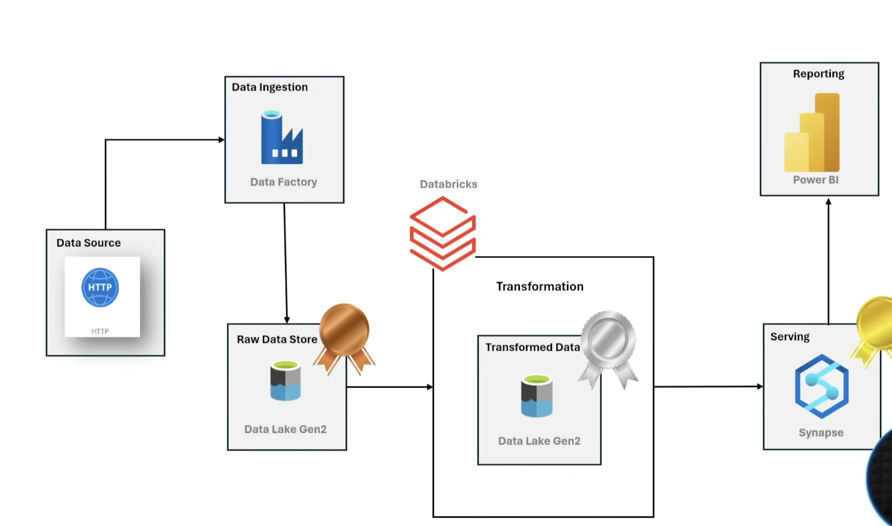

# Data_Engineering_Project

## Introduction 
## About Data
**Name of the data**:- Adventure Works  
Adventure Works is a comprehensive dataset designed for real-world data engineering and analytics projects. It includes multiple dimension and fact tables, representing various business processes over several years. This dataset is perfect for understanding complex relationships in a structured database. It is widely used for ETL, data modeling, and reporting practices. Access the original dataset at [Kaggle](https://www.kaggle.com/datasets/ukveteran/adventure-works?resource=download )
## Architecture 

## Services used
1. Resource Group - Container
2. Data Lake Gen 2 - Storage 
3. Data Factory - Extracting On-Premise to Storage account
4. Databricks - Transformation
5. Synapse Analytics - Warehouse 
6. Power BI - Business Insights
